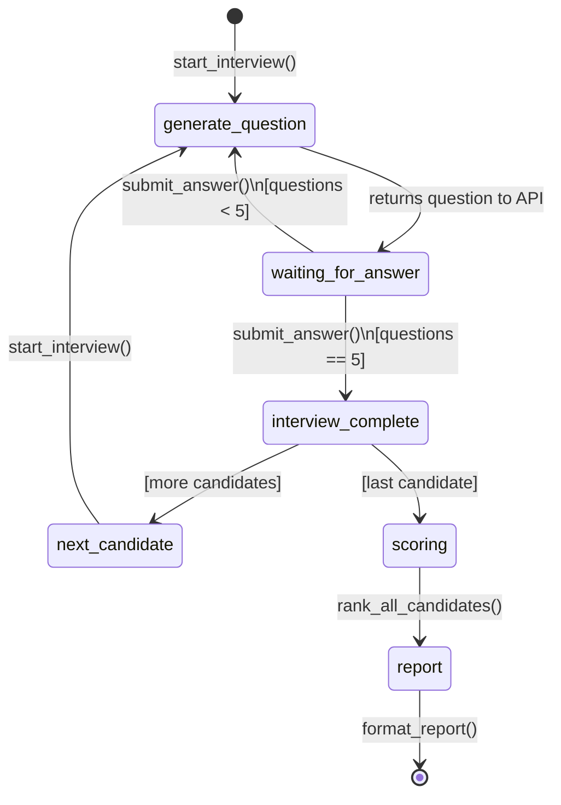
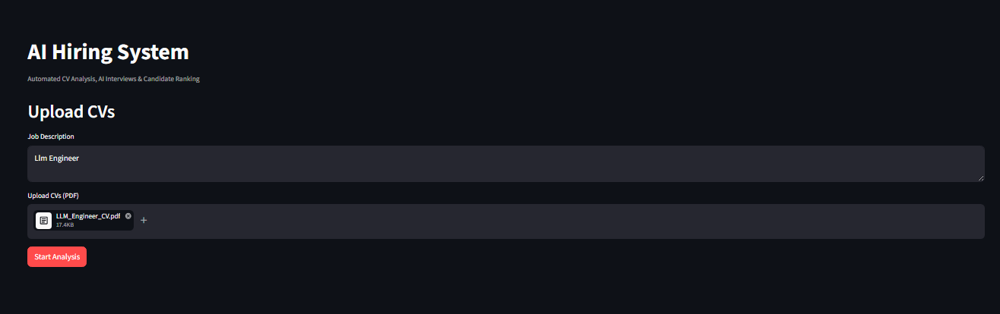

# AI Hiring System

A multi-agent AI system that automates the hiring pipeline: CV analysis, AI-driven interviews, candidate scoring, and HR-ready reporting.

## Architecture

```
CV Analyzer Agent  ->  Interview Agent  ->  Scoring Agent  ->  Report Writer
                            ^
                      LangGraph Orchestrator
```

### LangGraph Interview Flow



The key architectural decision: each node pauses after generating one question and returns control to the HTTP layer. The `MemorySaver` checkpointer preserves state across HTTP requests using a `thread_id` tied to the session.

## Screenshots

**Step 1 — Upload CVs and Job Description**


**Step 2 — AI Interview in Progress (real-time Q&A per candidate)**


**Step 3 — Scoring and Report Generation**


**Step 4 — Final HR Report**


**API Documentation (Swagger UI)**
.png)

---

## Setup

### Clone the repository
```bash
git clone https://github.com/amira-mhmd-ml/ai-hiring-system.git
cd ai-hiring-system
```

### 1. Activate the virtual environment
```bash
venv\Scripts\activate
```

### 2. Install dependencies
```bash
pip install -r requirements.txt
```

### 3. Add your API key
Copy `.env.example` to `.env` and fill in your real key:
```
GOOGLE_API_KEY=your_key_here
```

### 4. Run the server
```bash
uvicorn main:app --reload
```

### 5. Open the API documentation
```
http://localhost:8000/docs
```

## API Endpoints

| Method | Endpoint | Description |
|--------|----------|-------------|
| POST | `/upload-cvs` | Upload CVs and job description |
| POST | `/analyze/{id}` | Analyze CVs and start the first interview, returns the first question |
| POST | `/interview/{id}/answer` | Submit an answer; returns the next question, or moves to the next candidate, or triggers scoring once all candidates are done |
| GET | `/status/{id}` | Check session status (`interviewing`, `scoring`, `complete`, `failed`) |
| GET | `/report/{id}` | Get the final report |
| GET | `/health` | Server health check |

The interview is interactive by design: each call to `/analyze` or `/interview/{id}/answer` returns one question and waits for the next HTTP request with the candidate's answer, rather than running the whole interview in one blocking call.

## Running the Demo

End-to-end run without starting the API server:
```bash
python demo.py path/to/cv1.pdf path/to/cv2.pdf
```

## Running Tests

```bash
pytest tests/ -v
```

27 tests covering CV parsing edge cases, weighted scoring boundaries, and orchestrator routing logic (full success, partial failure, total failure).

## Testing Individual Agents

```bash
# Test the CV Analyzer
python -m agents.cv_analyzer path/to/cv.pdf

# Test the Scoring Agent
python -m agents.scoring_agent

# Test the Report Writer
python -m agents.report_writer
```

## Project Structure

```
ai-hiring-system/
|
├── agents/
│   ├── __init__.py
│   ├── cv_analyzer.py      # CV Analysis Agent
│   ├── interview_agent.py  # Interview Agent (LangGraph)
│   ├── scoring_agent.py    # Scoring & Ranking Agent
│   ├── report_writer.py    # Report Generation Agent
│   └── orchestrator.py     # Master Orchestrator (LangGraph)
|
├── tests/
│   ├── test_cv_analyzer.py
│   ├── test_scoring_agent.py
│   └── test_orchestrator.py
|
├── uploads/                # CV file storage (gitignored)
├── venv/                   # Virtual environment (gitignored)
├── main.py                 # FastAPI application
├── demo.py                 # End-to-end demo script
├── requirements.txt
├── .env.example             # Template for required environment variables
└── README.md
```

## Deployment (Render / Railway - Free Tier)

This project runs locally by default but is ready for a free-tier cloud deploy:

1. Push to GitHub (after confirming `.env` is gitignored - see `.gitignore`).
2. Render: New -> Web Service -> connect repo -> Build command: `pip install -r requirements.txt` -> Start command: `uvicorn main:app --host 0.0.0.0 --port $PORT`.
3. Environment variables: add `GOOGLE_API_KEY` (or `OPENAI_API_KEY`) in Render's dashboard - never in code.
4. Known limitation: the current `sessions = {}` in-memory store resets on every redeploy/restart. For a real deployed demo, swap to PostgreSQL before relying on it for persistent sessions.

## Privacy & PII Handling

This system processes sensitive personal data (names, contact details, career history). It follows these principles:

- **Storage**: uploaded CVs are saved under `uploads/{session_id}/`, isolated per session and never mixed between hiring rounds.
- **Retention**: CV files are retained for 7 days after upload, giving HR enough time to review the report or revisit a candidate's original file. After 7 days, files should be deleted automatically (a cleanup job is not yet scheduled - currently a manual/cron task to implement).
- **Not exposed**: the `uploads/` directory is excluded from git via `.gitignore` and is never served as a public static folder.
- **Database**: in the current in-memory `sessions` dict, candidate data lives only for the process lifetime. In a PostgreSQL version, the same 7-day retention policy should apply via a scheduled delete job on sessions older than 7 days (cascading to all related tables).
- **Known gaps**: encryption at rest, a GDPR-style "right to be forgotten" endpoint, and audit logging of who accessed which report are not implemented yet. These are noted as known gaps, not silently ignored.

## Key Engineering Decision: Why LangGraph, Not a Sequential LangChain Chain

**The problem**
The Interview Agent cannot follow a fixed script. It needs to ask a question, read the candidate's answer, and decide the next question based on that answer - sometimes going deeper on a weak answer, sometimes moving on. A standard LangChain sequential chain (`prompt | llm | prompt | llm`) executes a fixed, linear sequence with no way to loop back or branch based on runtime output.

**Options considered**
1. LangChain sequential chain - simplest to write, but cannot loop or branch.
2. A manual Python while-loop calling the LLM directly - would work, but discards LangChain's prompt/output tooling and becomes unmaintainable as more agents are added.
3. LangGraph StateGraph - models the workflow as nodes and conditional edges, with a shared state object that persists across turns.

**Why LangGraph**
It treats the interview as a graph with a real decision point (`receive_answer -> generate_question or evaluate`), driven by `add_conditional_edges`. The same pattern scales cleanly to the Orchestrator, which needs the identical "did this stage succeed enough to continue?" logic between CV Analysis, Interview, Scoring, and Report stages.

**Known trade-off**
LangGraph adds a real learning curve and another abstraction layer on top of LangChain. For a strictly linear, no-loop pipeline (for example, a simple RAG Q&A), it would be unnecessary overhead. The decision only pays off because this system genuinely needs loops and conditional stopping, not because LangGraph is always "better."

## Known Limitations

This project is functional end-to-end, but the following gaps are known and not silently ignored:

- **No persistent database yet**: sessions are stored in an in-memory Python dict (`sessions = {}` in `main.py`). This works for a local demo but means all data is lost on server restart. A PostgreSQL schema is designed (see Architecture) but not yet wired in.
- **Interview flow lacks dedicated tests**: the 27 automated tests in `tests/` cover CV parsing, scoring logic, and orchestrator routing. The interactive interview flow (`start_interview` / `submit_answer` in `interview_agent.py`), which uses LangGraph's `MemorySaver` to pause and resume between questions, does not yet have its own test coverage.
- **No authentication on the API**: any client can call `/upload-cvs` and submit CVs. For a real deployment, this would need an auth layer (API keys or OAuth) before going further than a personal demo.
- **CV retention policy is documented, not automated**: the README states a 7-day retention policy for uploaded CVs (see Privacy section), but the actual scheduled deletion job is not implemented yet — currently a manual cleanup task.

## Key Technologies

- **LangGraph** - multi-agent orchestration and interview loop
- **LangChain + Gemini/GPT-4o** - LLM integration
- **PyMuPDF** - PDF text extraction
- **FastAPI** - REST API
- **Pydantic** - data validation and structured output
- **Asyncio + Semaphore** - concurrent CV processing
- **Streamlit** - HR-facing dashboard
- **pytest** - automated testing